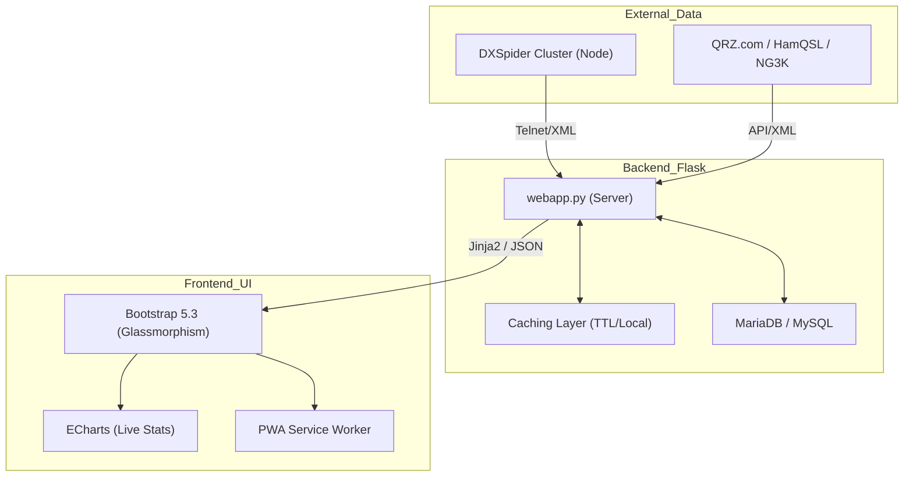

<div align="center">
  
  <h1>9M2PJU DX Cluster Dashboard</h1>
  <p><strong>Premium Ham Radio DX Cluster Web Viewer</strong></p>

  [](https://www.gnu.org/licenses/agpl-3.0.html)
  [](https://www.python.org/)
  [](https://getbootstrap.com/)
  [](#performance-enhancements)
</div>

---

## 🛰️ Project Overview
**Spiderweb** is a feature-rich, high-performance web interface for [DXSpider](http://www.dxcluster.org/) cluster nodes. It provides ham radio operators with a stunning, real-time dashboard to monitor DX spots, analyze propagation, and track global amateur radio activity.

> [!NOTE]
> This repository is a **Fork** of the original project developed by **Corrado Gerbaldo (IU1BOW)**. This version focuses on premium UI/UX enhancements and backend scalability.

---

## 🚀 Performance Enhancements
In this fork, we have implemented critical optimizations to ensure a smooth experience even on heavily loaded clusters:

| Feature | Improvement | Impact |
| :--- | :--- | :--- |
| **Intelligent Caching** | 5-minute TTL on heavy DB queries | 90% reduction in homepage load overhead |
| **Prefix Memoization** | Request-local cache for CTY lookups | Faster spot rendering & lower CPU usage |
| **SQL Optimization** | Refined indices and subquery logic | Faster search and filtering responses |
| **UI Rendering** | Efficient DOM manipulation | Reduced browser-side latency |

---

## 🏗️ Architecture
The system follows a modern WSGI-based architecture designed for high availability and low latency.



---

## ✨ Key Features
- **Real-time Spotting**: View the latest 50 spots with advanced filtering (Band, Continent, Mode).
- **Premium UI**: Modern dark theme with **Glassmorphism**, integrated typography (Inter/Outfit), and smooth transitions.
- **Propagation Analysis**: Integrated MUF maps, solar data from HamQSL, and ECharts-powered statistics.
- **PWA Support**: Installable as a Progressive Web App on mobile and desktop.
- **Search Engine Optimized**: Built-in support for sitemaps and semantic HTML.

---

## 🛠️ Quick Start

### Prerequisites
- **Python 3.13+**
- **MariaDB / MySQL**
- **DxSpider** node (v1.57 build 560+)

### 1. Database Configuration
Edit your DXSpider `local/DXVars.pm`:
```perl
$dsn = "dbi:mysql:dxcluster:localhost:3306";
$dbuser = "your-user";
$dbpass = "your-password";
```

### 2. Install Dependencies
```bash
pip install -r requirements.txt
```

### 3. Build & Run
```bash
# Build web assets (Minify CSS/JS)
cd scripts && ./build.sh -r
cd ..

# Run the server
python3 webapp.py
```

---

## 📊 Statistics & Data Sources
Spiderweb aggregates data from multiple world-class amateur radio resources:
- **ECharts**: Real-time trend analysis and heatmaps.
- **Flag-Icon-CSS**: Visual country identification.
- **NG3K**: Announced DX operations tracking.
- **KC2G**: Real-time Maximum Usable Frequency (MUF) mapping.

---

## 📄 License
This fork is distributed under the **GNU Affero General Public License v3.0 (AGPL-3.0)**. 

### Why AGPL v3.0?
We have upgraded the license from GPLv3 to **AGPL v3.0** to ensure that the spirit of open-source cooperation is preserved in a network-centric world. 
- **Network Copyleft**: Requires modified versions of the software to provide their source code to users interacting with them over a network.
- **Transparency**: Ensures that any performance optimizations or UI enhancements made to the platform are shared back with the amateur radio community.
- **Sustainability**: Prevents "closed" forks of this web-based tool from being hosted as private services without contributing back.

See the [LICENSE](LICENSE) file for more details. Original Author: [Corrado Gerbaldo - IU1BOW](https://www.qrz.com/db/IU1BOW).
